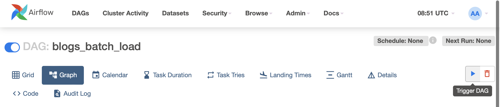

# Blogs-Data-Pipeline

## Overview

### General

This repo is a proof of concept that shows how to orchestrate the ingestion of batch data using Airflow for an **[ELT](https://en.wikipedia.org/wiki/Extract,_load,_transform)** (_Extract, Load, Transform_) approach.

The ingestion of data from source to the datawarehouse follows the below steps:

1. Files are placed on an SFTP server
2. SFTP files are extracted to a local file system location
3. Files are ingested into Postgres staging tables using **Apache Spark**
   1. Table ingestion is a full load (_truncate then insert_)
   2. Spark asserts the file schema when inserting
4. SQL scripts are ran which perform **[CTEs](https://www.postgresql.org/docs/current/queries-with.html)** and **MERGE** / **INSERT** statements to load the user facing Postgres presentation (_gold_) tables

A diagram of this process can be seen below:


The below technologies are used for running the repo locally as well as within the pipeline process.

* [Apache Airflow](https://airflow.apache.org)
* [Apache Spark](https://spark.apache.org)
* [PostgreSQL](https://www.postgresql.org)
* [Make](https://www.gnu.org/software/make/)
* [Docker](https://www.docker.com)
* [Docker Compose](https://docs.docker.com/compose/)

### Data Diagrams

#### Source Schema

The source data placed in CSV files on the SFTP server were created to mirror a sample operational database schema in [3NF](https://en.wikipedia.org/wiki/Third_normal_form#:~:text=Third%20normal%20form%20(3NF)%20is,in%201971%20by%20Edgar%20F.).


#### Target Schema

The data is ingested into the datawarehouse modeled using [star schema](https://en.wikipedia.org/wiki/Star_schema).


## How to Run

The [Docker Compose](#docker-compose) section details how to build and run the project locally. This requires the **Docker** and **Docker Compose** technologies mentioned previously.

The [Pipeline Execution](#pipeline-execution) section details how to navigate airflow and run the pipeline.

### Docker Compose

1. Build the custom dockerfile in the project by running the below command for your respective OS

```bash
# Linux / Mac OS Users
docker compose -f docker-compose.airflow.yaml build --build-arg TARGETARCH=$(uname -m)

# Windows Users
# Change amd64 to arm64 if you have ARM CPU architecture
docker compose -f docker-compose.airflow.yaml build --build-arg TARGETARCH=amd64
```

2. Run the compose environment

```bash
docker compose -f docker-compose.airflow.yaml -f docker-compose.common.yaml up -d
```

**Note:** The compose environment may take 1-2 minutes to be available for access via localhost URLs.

### Pipeline Execution

To run the **blogs_batch_load** data pipeline within the local docker compose environment follow the below steps.

1. Navigate to **http://localhost:8080** and login with the below credentials
* **user_id**: airflow
* **password**: airflow


1. Activate the DAG **blogs_batch_load** by clicking the toggle indicated in the below image


3. Click the button shown in the below image to trigger execution of the DAG / pipeline



4. In the left pane click on green rectangle for the ran instance. This should display a successful DAG run.


### Spinning Down the Environment

The compose containers can be stopped and removed with the below command

```bash
docker compose -f docker-compose.airflow.yaml -f docker-compose.common.yaml down
```

## Future Improvements

Although the proof of concept is working there are a couple improvements which could be made:

* Currently the secrets for connections are plaintext in this repo and would not be acceptable in any deployed architectures
  * The repo is set up to use the Airflow [Secrets Backend](https://airflow.apache.org/docs/apache-airflow/stable/security/secrets/secrets-backend/index.html)
    * This currently uses local files but could be improved to use something like Hashicorp Vault
* The Users data has plaintext values for first_name, last_name, and email
  * PII fields associated with actual individuals should be masked or not ingested at all if not needed for analysis
  * Within this simple POC fake data was generated for fake individuals which are plaintext values
* There are unit tests present for the Airflow DAG but they could be made more robust
  * Currently there are general unit tests for the DAG tasks, checking to see if the DAG can be imported, and if there are any cycles
  * The existing unit tests for the **SQLExecuteQueryOperator** could include more meaningful asserts
  * Unit tests could be added to confirm that the SQL associated with **SQLExecuteQueryOperator** tasks renders properly

## Development

### Requirements

For dev work this repo requires that the **pre-commit** package is installed ([info here](https://pre-commit.com/#install)).

### Setup

Within a virtual environment run the below commands.

```bash
python -m venv venv
. venv/bin/activate
pip install -r requirements.txt
pre-commit install
```
